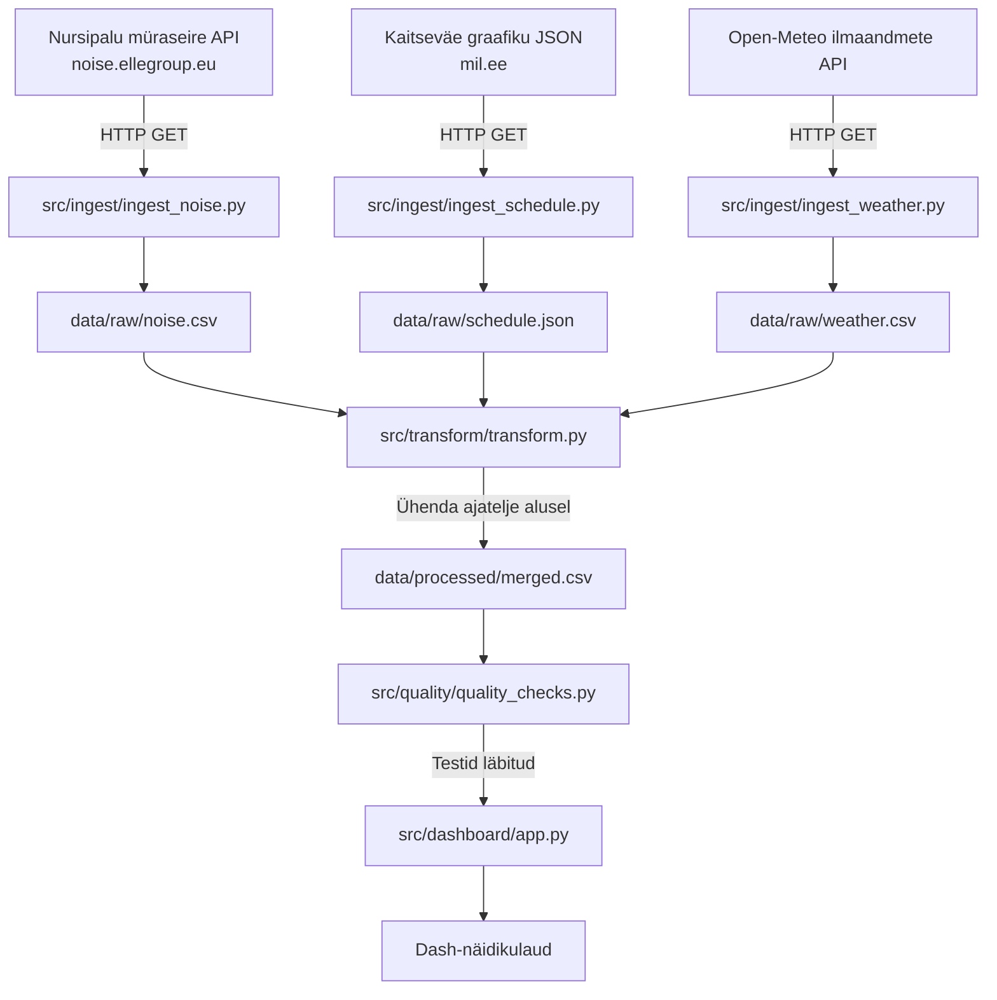

# NURSIPALU MÜRASEIRE, HARJUTUSGRAAFIKU JA ILMASTIKUANDMETE KÕRVUTAMINE
Andmetöövoog Nursipalu harjutusvälja graafiku, müraseire ja ilmastikuandmete kõrvutamiseks.

## Äriküsimus

Kas Nursipalu harjutusvälja graafikus planeeritud tegevused ja samaaegsed ilmastikutingimused on seotud müraseirejaamas mõõdetud mürataseme tõusudega?

**Mõõdikud:**

1. [Mitu % mürataseme tõusudest langeb kokku planeeritud tegevustega]
2. [Mõõdetud mürataseme võrdlus harjutusvälja graafikus planeeritud mürakategooriatega]
3. [Mõõdetud müratase tuulesuuna ja tuulekiiruse järgi]

## Arhitektuur 



---

## Andmestik

| Andmeallikas | Kirjeldus | Muutuvus ajas |
|---|---|---|
| Nursipalu müraseire avaandmed | Müraseirejaama mõõtmistulemused | Uuenevad ajas |
| Kaitseväe harjutusvälja graafik | Planeeritud tegevused ja mürataseme kategooriad | Uuenev JSON-fail |
| Ilmastikuandmed | Tuul, õhurõhk, pilvisus, sademed jm ilmastikunäitajad | Päringu alusel ajas muutuvad |

Kasutatavad andmeallikad:

- Nursipalu müraseire avaandmed: https://noise.ellegroup.eu/public/1
- Kaitseväe harjutusvälja graafiku JSON: https://mil.ee/wp-content/uploads/training-grounds/training_ground_schedule.json
- Ilmastikuandmed: näiteks Open-Meteo või muu avalik ilmaandmete allikas

## Stack

| Komponent | Tööriist |
|-----------|---------|
| Sissevõtt | [Python / Airflow / muu] |
| Transformatsioon | [SQL / dbt / muu] |
| Andmehoidla | PostgreSQL |
| Näidikulaud | [Superset / Streamlit / muu] |
| Orkestreerimine | [Airflow / cron / muu] |

## Käivitamine

```bash
# 1. Klooni repo ja liigu kausta
git clone <repo-url>
cd <projekti-kaust>

# 2. Kopeeri keskkonnamuutujad
cp .env.example .env
# Muuda .env failis paroolid ja muud seaded vastavalt vajadusele

# 3. Käivita teenused
docker compose up -d --build

# 4. [Vabatahtlik: käivita sissevõtt käsitsi esimesel korral]
# docker compose exec pipeline python scripts/run_pipeline.py run-all
```

Airflow (kui kasutatakse): http://localhost:8080 (kasutaja: airflow / parool: airflow)
Näidikulaud: http://localhost

## Saladused ja konfiguratsioon

Kõik saladused (paroolid, API võtmed, andmebaasi URL-id) on `.env` failis. Repos on ainult `.env.example`, mis näitab vajalike muutujate struktuuri ilma tegelike väärtusteta. Päris `.env` faili ei tohi GitHubi panna - see on `.gitignore`-s.

Vajalikud muutujad:

| Muutuja | Tähendus | Näide |
|---------|----------|-------|
| `DB_PASSWORD` | PostgreSQL parool | (saladus) |
| `[teised]` | ... | ... |

## Andmevoog lühidalt

1. **Sissevõtt** — [Kirjelda, kuidas andmed allikast kätte saadakse]
2. **Laadimine** — Andmed laaditakse `staging` kihti
3. **Transformatsioon** — [Kirjelda peamised arvutused ja mudelid]
4. **Testimine** — [Mitu] andmekvaliteedi testi kontrollivad korrektsust
5. **Näidikulaud** — [Kuvab müraseirejaamas mõõdetud mürataseme seoseid graafikus palneeritud tegevuste mürakategooriatega, samuti seost ilmastikuandmetega.]

## Andmekvaliteedi testid

Projekt kontrollib järgmist:

1. Puuduvate väärtuste kontroll: tagatakse, et kriitilised väljad ei oleks puudu
2. Unikaalsuse kontroll: välditakse dublikaate
3. Väärtuste vahemiku kontroll: kontrollitakse, et andmete väärtused jääksid realistlikesse piiridesse
4. Äriloogika kontroll: kontrollitakse, et sündmuse algusaeg oleks alati varasem kui lõpuaeg


Testide tulemused: [kuhu salvestatakse / kuidas vaadata]
# docker compose run --rm pipeline pytest tests/test_quality.py -v

## Projekti struktuur

```
.
├── README.md
├── compose.yml
├── .env.example
├── .gitignore
├── docs/
│   ├── arhitektuur.md      ← nädal 1 väljund
│   └── progress.md         ← nädal 2 väljund
└── ...                     ← ülejäänud projektifailid
```

## Kokkuvõte, puudused ja võimalikud edasiarendused

**Kokkuvõte:**
- [Loetle, mis on lõpule viidud, mis töötab hästi]

**Puudused:**
- [Loetle ausalt, mis jäi tegemata - see ei mõjuta hinnet negatiivselt, vaid aitab hinnata]

**Mis edasi:**
- [Andmestikud võimaldavad uurida oluliselt põhjalikumalt võimalikke seoseid mõõdetud müra ja ilmastiku andmete vahel.]

## Meeskond

| Nimi | Roll |
|------|------|
| Hanna Heinnurm | projektijuht (teema algataja) |
| Roland Pajuleht | transformatsioonide omanik (andmebaaside ülesseadmine, andmete projektijuht) |
| Raili Jäe | näidikulaua omanik |
| Aldo Rääbis | kvaliteedi omanik |


## Töö etapid 

Siia vist võiksime juurde kirjutada ka samm sammulised mõtted, et milline projekt on

1. Määratleda äriküsimus. Sõnastada, mida soovitakse teada saada (kas harjutused ja ilm mõjutavad mürataset).
2. Kaardistada andmeallikad. Leida müraseire, harjutusgraafiku ja ilmastiku andmeallikad ning kontrollida ligipääsu.
3. Luua projekti struktuur. Teha GitHubi repo, kaustad, README ja vajalikud konfiguratsioonifailid.
4. Koguda andmed automaatselt. Luua skriptid, mis laadivad regulaarselt alla müra-, ilma- ja harjutusgraafiku andmed.
5. Salvestada toorandmed. Hoida algandmed failides või andmebaasis, et neid saaks hiljem uuesti kasutada.
6. Puhastada ja teisendada andmed. Ühtlustada ajatemplid, eemaldada vigased väärtused ja viia kõik andmed samale ajatasemele (nt tunnipõhiseks).
7. Ühendada andmed üheks tabeliks. Siduda müraseire, harjutusgraafiku ja ilmastikuandmed ühise ajajoone alusel.
8. Kontrollida andmekvaliteeti. Teha testid puuduvate väärtuste, duplikaatide ja ebareaalsete mõõtmiste leidmiseks.
9. Luua dashboard / näidikulaud. Kuvada graafikud ja KPI-d, mis aitavad võrrelda mürataset, harjutusi ja ilmastikku.
10. Analüüsida tulemusi. Vaadata, kas harjutuste ja mürataseme vahel ilmneb ajaline seos ning kuidas ilm võib tulemusi mõjutada.
11. Dokumenteerida projekt. Kirjeldada arhitektuur, töövoog, testid, piirangud ja käivitamise juhend.
12. Esitleda lõpptulemust. Salvestada demo/video ja näidata kogu andmetöövoogu allikast dashboardini.
