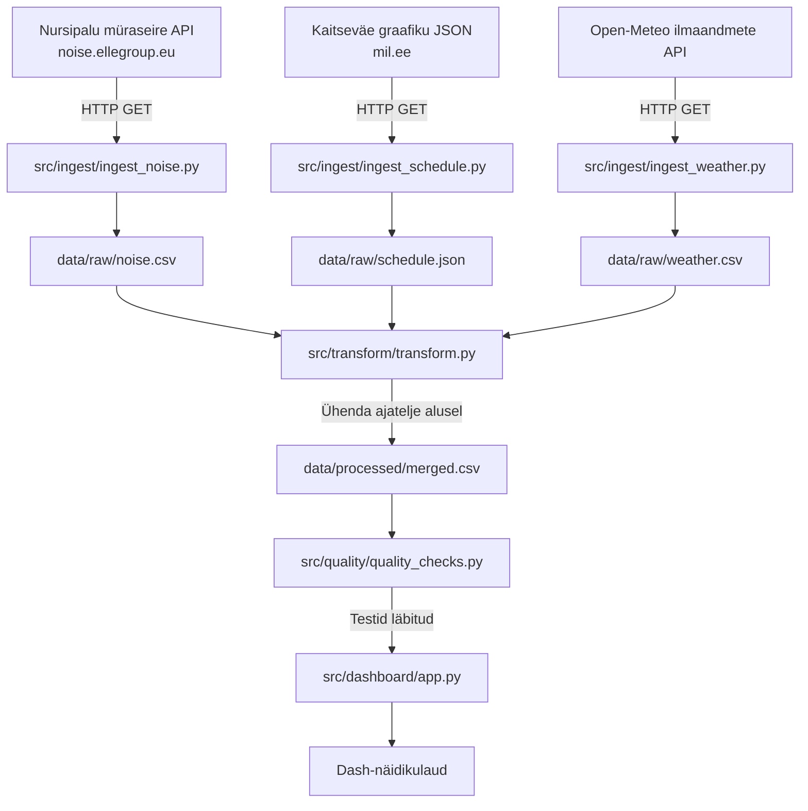

# NURSIPALU MÜRASEIRE, HARJUTUSGRAAFIKU JA ILMASTIKUANDMETE KÕRVUTAMINE
Andmetöövoog Nursipalu harjutusvälja graafiku, müraseire ja ilmastikuandmete kõrvutamiseks.

## Äriküsimus

Kas Nursipalu harjutusvälja graafikus planeeritud tegevused ja samaaegsed ilmastikutingimused on seotud müraseirejaamas mõõdetud mürataseme tõusudega?

**Mõõdikud:**

1. Mitu % mürataseme tõusudest langeb kokku planeeritud tegevustega.
2. Mõõdetud mürataseme võrdlus harjutusvälja graafikus planeeritud mürakategooriatega.
3. Mõõdetud müratase tuulesuuna ja tuulekiiruse järgi.

## Arhitektuur 



---

## Andmestik

| Andmeallikas | Kirjeldus | Muutuvus ajas |
|---|---|---|
| Nursipalu müraseire avaandmed | Müraseirejaama mõõtmistulemused | Uuenevad ajas |
| Kaitseväe harjutusvälja graafik | Planeeritud tegevused ja mürataseme kategooriad | Uuenev JSON-fail |
| Ilmastikuandmed | Tuul, õhurõhk, pilvisus, sademed jm ilmastikunäitajad | Päringu alusel ajas muutuvad |

Kasutatavad andmeallikad:

- Nursipalu müraseire avaandmed: https://noise.ellegroup.eu/public/1
- Kaitseväe harjutusvälja graafiku JSON: https://mil.ee/wp-content/uploads/training-grounds/training_ground_schedule.json
- Ilmastikuandmed: näiteks Open-Meteo või muu avalik ilmaandmete allikas

## Stack

| Komponent | Tööriist |
|-----------|---------|
| Sissevõtt | Python, Requests |
| Transformatsioon | SQL, Python |
| Andmehoidla | DuckDB |
| Seirepaneel | Dash, Plotly |
| Orkestreerimine | APScheduler |
| Testimine | pytest |
| Käivitamine | Docker Compose |

## Käivitamine

```bash
# 1. Klooni repo ja liigu kausta
git clone <(https://github.com/heinnurmhanna/nursipalu-muraseire-analuus)>
cd <projekti-kaust>

# 2. Kopeeri keskkonnamuutujad
cp .env.example .env
# Muuda .env failis paroolid ja muud seaded vastavalt vajadusele

# 3. Käivita teenused
docker compose up -d --build

```

Näidikulaud: [http://localhost](http://localhost:8050)

## Saladused ja konfiguratsioon

Projekt ei vaja praeguses seisus eraldi API võtmeid, kuid andmeallikate URL-id, koordinaadid ja käivitusintervallid loetakse keskkonnamuutujatest. Repos peaks olema ainult `.env.example`; päris `.env` faili ei tohi GitHubi panna.

Vajalikud või kasutatavad muutujad:

| Muutuja | Tähendus | Näide / vaikimisi väärtus |
|---------|----------|---------------------------|
| `DB_PATH` | DuckDB andmebaasi asukoht | `data/nursipalu.duckdb` |
| `DASH_PORT` | Dash seirepaneeli port | `8050` |
| `NOISE_INTERVAL_HOURS` | Müraandmete uuendamise intervall tundides | `1` |
| `SCHEDULE_INTERVAL_HOURS` | Ajakava uuendamise intervall tundides | `1` |
| `WEATHER_INTERVAL_HOURS` | Ilmaandmete uuendamise intervall tundides | `1` |
| `SCHEDULE_SOURCE_URL` | Kaitseväe harjutusväljade ajakava JSON-i URL | `https://mil.ee/wp-content/uploads/training-grounds/training_ground_schedule.json` |
| `WEATHER_SOURCE_URL` | Open-Meteo API baasaadress | `https://api.open-meteo.com/v1/forecast` |
| `WEATHER_LATITUDE` | Ilmapäringu laiuskraad | projekti `.env` väärtus |
| `WEATHER_LONGITUDE` | Ilmapäringu pikkuskraad | projekti `.env` väärtus |

## Andmevoog lühidalt

1. **Sissevõtt** — Python skriptid küsivad andmed müraseire API-st, Kaitseväe harjutusväljade ajakava JSON-ist ja Open-Meteo API-st. API vastused salvestatakse kaustadesse `data/raw/noise`, `data/raw/schedule` ja `data/raw/weather`.
2. **Laadimine** — Andmed kirjutatakse DuckDB tabelitesse `noise`, `schedule` ja `weather`.
3. **Transformatsioon** — `schema.py` loob `merged` vaate, mis ühendab müra-, ajakava- ja ilmaandmed tunnipõhiseks analüüsiks.
4. **Testimine** — 4 andmekvaliteedi testi kontrollivad korrektsust
5. **Näidikulaud** — Dash kuvab müraseirejaamas mõõdetud mürataseme seoseid graafikus palneeritud tegevuste mürakategooriatega, samuti seost ilmastikuandmetega.

## Andmekvaliteedi testid

Projekt kontrollib järgmist:

1. Puuduvate väärtuste kontroll: tagatakse, et kriitilised väljad ei oleks puudu
2. Unikaalsuse kontroll: välditakse dublikaate
3. Väärtuste vahemiku kontroll: kontrollitakse, et andmete väärtused jääksid realistlikesse piiridesse
4. Äriloogika kontroll: kontrollitakse, et sündmuse algusaeg oleks alati varasem kui lõpuaeg


Testide tulemused: [kuhu salvestatakse / kuidas vaadata]
docker compose run --rm pipeline pytest tests/test_quality.py -v

## Projekti struktuur

```
.
├── README.md
├── compose.yml
├── Dockerfile
├── requirements.txt
├── .env.example
├── .gitignore
├── data/
│   ├── raw/
│   │   ├── noise/
│   │   ├── schedule/
│   │   └── weather/
│   ├── staged/
│   └── processed/
├── docs/
│   ├── arhitektuur.md
│   └── progress.md
├── src/
│   ├── main.py
│   ├── ingest/
│   │   ├── ingest_noise.py
│   │   ├── ingest_schedule.py
│   │   └── ingest_weather.py
│   ├── transform/
│   │   └── schema.py
│   └── dashboard/
│       └── app.py
└── tests/
    └── test_quality.py
```

## Kokkuvõte, puudused ja võimalikud edasiarendused

**Kokkuvõte:**
- Valmis on andmevoog, mis toob kokku müraandmed, harjutusvälja ajakava ja ilmaandmed.
- DuckDB andmebaasis luuakse `merged` vaade, mida kasutatakse analüüsiks ja näidikulaua jaoks.
- Näidikulaud kuvab LAFeq mürataset võrreldes Nursipalu harjutusvälja planeeritud mürakategooriatega.
- Näidikulaud näitab, millise tuulesuuna ja tuulekiiruse korral on mõõdetud kõrgemaid või madalamaid LAFeq väärtusi.
- Arvutatakse KPI „LAFeq ≥ 65 dB tundide kattuvus planeeritud tegevustega“.
- Andmekvaliteeti kontrollitakse pytest testidega.

**Puudused:**
- Müraandmete sissevõtt küsib vaikimisi viimase 24 tunni andmed; varasemate raw-failide täielikuks kasutamiseks on vaja eraldi backfill-loogikat.
- Ajaline kattuvus planeeritud tegevustega ei tõesta põhjuslikku seost, vaid näitab üksnes sündmuste samaaegsust.

**Mis edasi:**
- Andmestikud sisaldavad palju rohkem andmeid ilmastiku kohta ja võimaldavad uurida võimalikke seoseid mõõdetud müra ja ilmastiku andmete vahel põhjalikumalt.
- Lisada võimalus filtreerida jooniseid planeeritud mürakategooria järgi.

## Meeskond

| Nimi | Roll |
|------|------|
| Hanna Heinnurm | projektijuht (teema algataja) |
| Roland Pajuleht | transformatsioonide omanik (andmebaaside ülesseadmine, andmete projektijuht) |
| Raili Jäe | näidikulaua omanik |
| Aldo Rääbis | kvaliteedi omanik |


