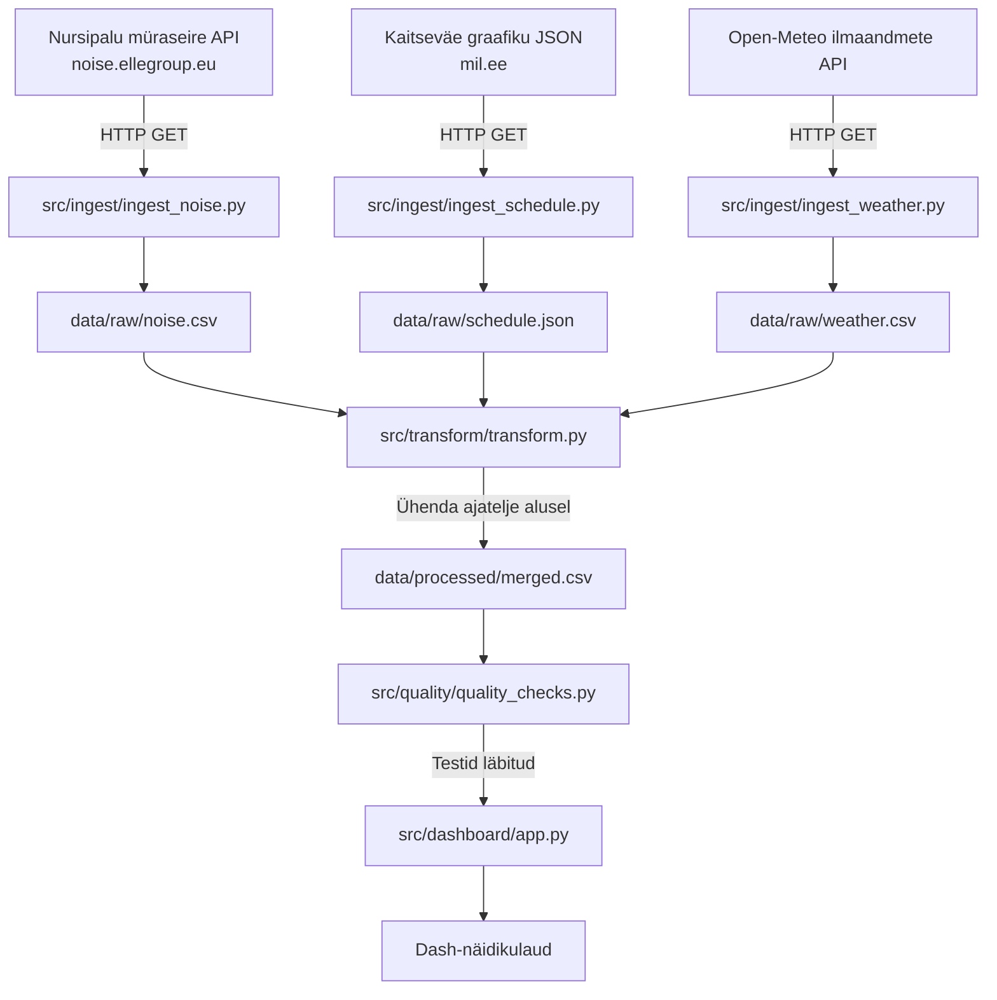

# Arhitektuur

## Äriküsimus

Kas Nursipalu harjutusvälja graafikus planeeritud tegevused ja samaaegsed ilmastikutingimused on seotud müraseirejaamas mõõdetud mürataseme tõusudega?

### Peamised mõõdikud

| Mõõdik | Kirjeldus |
|---|---|
| Mõõdetud müratase vs planeeritud mürakategooria | Võrdleb mõõdetud mürataset harjutusvälja graafikus planeeritud mürakategooriatega |
| Mürataseme tõusu juhtumite ajaline kattuvus graafiku tegevustega | Mitu % mürataseme tõusudest langeb kokku planeeritud tegevusega |
| Mõõdetud müratase tuulesuuna ja tuulekiiruse järgi | Võimaldab hinnata võimalikku seost tuulesuuna, -kiiruse ja mõõdetud mürataseme vahel |

---

## Arhitektuuriskeem

---

## Andmeallikad

| Andmeallikas | URL | Formaat | Muutuvus ajas | Ajagranulaarsus |
|---|---|---|---|---|
| Nursipalu müraseire avaandmed | https://noise.ellegroup.eu/public/1 | JSON/CSV | Uueneb pidevalt | Minutipõhine (arv. tunnipõhiseks) |
| Kaitseväe harjutusgraafik | https://mil.ee/wp-content/uploads/training-grounds/training_ground_schedule.json | JSON | Uueneb aeg-ajalt | Päeva- või sessioonipõhine |
| Open-Meteo ilmaandmed | https://api.open-meteo.com/v1/forecast | JSON | Päringu alusel | Tunnipõhine |

Kõik andmed viiakse **tunnipõhisele** ajatasemele ja **UTC** ajavööndisse enne ühendamist.

---

## Andmebaasi kihid

- Raw kiht: algandmed salvestatakse muutmata kujul `data/raw/` kausta või DuckDB raw-tabelitesse.
- Staging / transformatsioonikiht: ajatemplid ühtlustatakse, väljade nimed korrastatakse ja andmed viiakse tunnipõhisele ajatasemele.
- Analytical / mart kiht: müra-, graafiku- ja ilmaandmed ühendatakse ühise ajatelje alusel koondtabeliks või vaateks, mida kasutab dashboard.

---

## Tööjaotus

| Roll | Vastutus | Täitja |
|------|----------|--------|
| Andmeallika omanik | Kirjutab sissevõtu loogika, hoiab API-t töös | [Hanna] |
| Transformatsioonide omanik | Kirjutab mart kihi mudelid ja mõõdikute arvutuse | [Roland] |
| Kvaliteedi omanik | Kirjutab testid ja vaatab läbi ebaõnnestunud kontrollid | [Aldo] |
| Näidikulaua omanik | Ehitab näidikulaua ja seob selle äriküsimusega | [Raili] |

---

## Riskid

| Risk | Mõju | Maandus |
|---|---|---|
| Müraseire API struktuur muutub või muutub kättesaamatuks | Sissevõtu skript lakkab töötamast | Kontrollida ligipääsu esimesel nädalal; salvestada toorandmed lokaalselt |
| Andmeallikate ajagranulaarsus on erinev (minutid vs. tunnid vs. päevad) | Andmete kõrvutamine on keeruline | Viia kõik andmed tunnipõhiseks transformatsioonietapis |
| Harjutusgraafik kirjeldab planeeritud, mitte tegelikku tegevust | Seose tõlgendamine on piiratud | Kirjeldada see selgelt projekti piiranguna dashboardil ja README-s |

---

## Privaatsus ja turve

Kasutatavad andmed on avalikud. Projekt ei töötle isikuandmeid ega konfidentsiaalseid tööandja andmeid.

Konfiguratsioon ja võimalikud ligipääsuvõtmed hoitakse `.env` failis, mida GitHubi ei lisata. Repos on ainult `.env.example`, mis näitab vajalikke keskkonnamuutujaid. `.gitignore` välistab `.env` ja lokaalse `data/` kausta.

